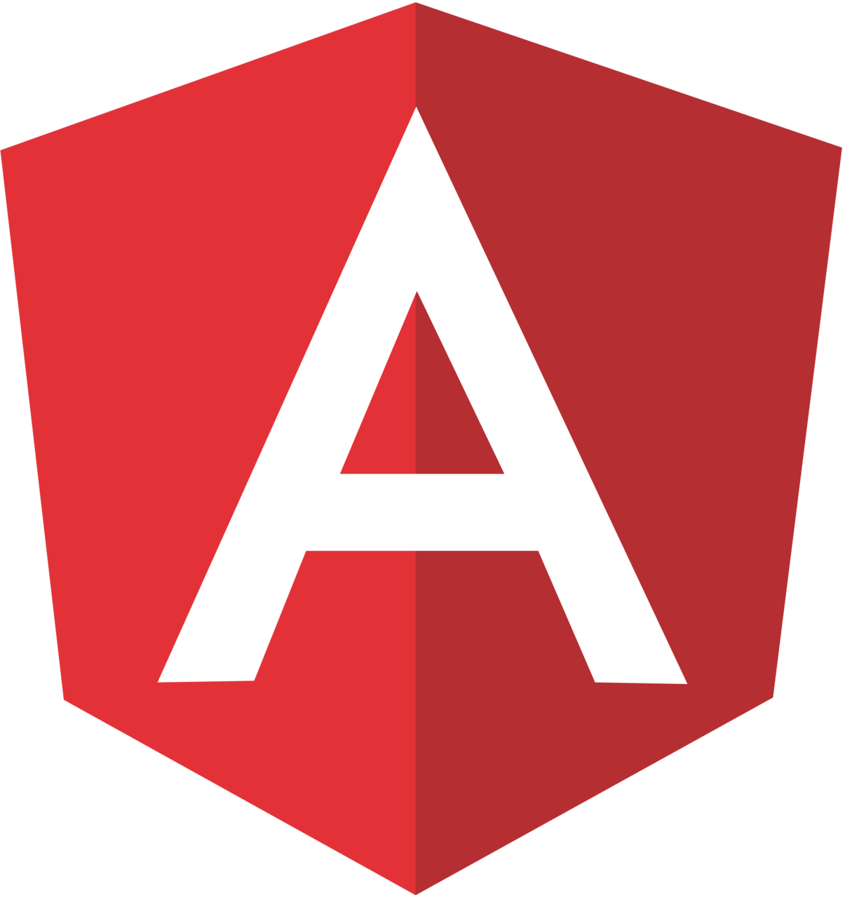

# Examen Parcial 1
## 5 Tecnologias actuales en el desarrollo web
### Astro

Fuente:[ https://images.seeklogo.com/logo-png/42/1/astro-logo-png_seeklogo-428045.png](https://images.seeklogo.com/logo-png/42/1/astro-logo-png_seeklogo-428045.png)

Astro es un framework de desarrollo web pensado para sitios estáticos basados en contenido, aunque también admite blogs, landings o ecommerce. Su rendimiento proviene de no enviar JavaScript salvo que sea necesario y de las Server Islands, que hacen dinámicos solo ciertos componentes. 

**¿Cual es su uso ideal?**

El uso de Astro es ideal para páginas web que son orientadas a:

- Blogs y sitios de contenido
- Portafolios Personales
- Landing Pages 
- Documentación Tecnica
- Sitios Corporativos

**Empresas que utilizan esta tecnologia**

- [Porsche](https://www.porsche.com/)
- [Mattel](https://shop.mattel.com/es-mx)
- [At&t](https://www.att.com.mx/)
- [Honda](https://www.honda.mx/)
- [Hyatt Hotels Corporation](https://www.hyatt.com/)

------------------------------------------------------

### React

Fuente: [https://www.fableadtechnolabs.com/static/media/react.df0a99571b16103764a8.webp](https://www.fableadtechnolabs.com/static/media/react.df0a99571b16103764a8.webp)

React es una herramienta creada inicialmente por los desarrolladores de Facebook para resolver porblemas específicos con los que se encontraban al crear aplciaciones comlejas y dinámicas.
Aunque puede sonar complicado, la idea detrás de React es bastante simple: te ayuda a construir tus proyectos web usando pequeños bloques llamados componentes, como si fueran pedazos de lego, los ensamblas, para poder crear interfaces de usuario.

**¿Cuál es su uso ideal?**

El uso de React en páginas web son orientadas a:

- Aplicaciones web complejas
- Dashboards y admin panels 
- Progressive web apps
- Apps que requieran mucha interactividad

Empresas que utilizan esta tecnología

- [Liverpool](https://www.liverpool.com.mx/)
- [ToysRus](https://www.toysrus.com.mx/)
- [Autozone](https://www.autozone.com.mx/)
- [LG](https://www.lg.com/)
- [Nissan](https://www.nissan.com.mx/)

-------------------------------------------------

### Angular

Fuente: [https://brandslogos.com/wp-content/uploads/images/large/angular-logo.png](https://brandslogos.com/wp-content/uploads/images/large/angular-logo.png)

Angular es un potente framework de de desarrollo de aplicaicones web creado por google, se basa en TypeScript ue es una versión mejorada de Javascript, y proporciona herramientas y estructuras para construir aplicaciones web modernas y dinámicas. 

**¿Cuál es su uso ideal?**

El uso de Angular esta orientado a:

- Aplicaciones empresariales grandes
- Sistemas de gestión complejos
- Apps financieras/bancarias
- Proyectos con equipos grandes
- Aplicaciones con módulos múltiples

Empresas que utilizan esta tecnología

- [Mastercard](https://www.mastercard.com/)
- [Toyota](https://www.toyota.com/)
- [Paramount](https://www.paramount.com/)
- [Banorte](https://www.banorte.com/)
- [Adidas](https://www.adidas.com/)

--------------------------------------------

### Vue.js

Fuente: [https://upload.wikimedia.org/wikipedia/commons/thumb/9/95/Vue.js_Logo_2.svg/3840px-Vue.js_Logo_2.svg.png](https://upload.wikimedia.org/wikipedia/commons/thumb/9/95/Vue.js_Logo_2.svg/3840px-Vue.js_Logo_2.svg.png)

Vue.js es un framework progresivo de Javascript que nos permite construir interfaces de usuario dinámicas y modernas, se le llama profresivo porqué puedes usarlo de manera gradual.

**¿Cuál es su uso ideal?**
El uso de Vue.js es mayormente para:

- Proyectos Medianos
- Equipos pequeños o medianos 
- Migración gradual de apps legacy
- Apps con curva de aprendizaje corta
- Startups con presupuesto ajustado

Empresas que utilizan esta tecnología

- [Suburbia](https://www.suburbia.com.mx/)
- [Innovasport](https://www.innovasport.com/)
- [Sony](https://www.sony.com.mx/)
- [Oxxo](https://www.oxxo.com/)
- [AMD](https://www.amd.com/)

-------------------------

### Node.js

Fuente: [https://images.seeklogo.com/logo-png/26/1/node-js-logo-png_seeklogo-269242.png](https://images.seeklogo.com/logo-png/26/1/node-js-logo-png_seeklogo-269242.png)

Node.js es un entorno de tiempo de ejecución de Javascript que se utiliza para crear aplicaciones escalables del lado del servidor y de red a través de servidores privados virtuales.

**¿Cuál es su uso ideal?**
Su uso ideal principalmente seria en: 
- Chat en tiempo real
- Streaming de datos
- Proxies del lado del servidor
- Aplicaciones de una sola página

Empresas que utilizan esta tecnología

- [Motorola](https://www.motorola.com.mx/)
- [US bank](https://www.usbank.com/)
- [harley-davidson](https://www.harley-davidson.com/)
- [Wester Union](https://www.westernunion.com/)
- [Fujifilm](https://www.fujifilm.com/)

## Reflexión Personal

La verdad es que en esta area de las páginas web ya tengo un conocimiento amplio, por ejemplo se lenguajes como php y mysql para bases de datos y conexión con ellas, html para la estructura de la página, css, y un poco de Javascript.
Muchas de las herramientas que mencione tambien ya las conocia como node.js o Angular, pero nunca le he dado la oportunidad a estas ultimas, pero la verdad si me gustaria aprender a usarlas y de hecho, hasta lo considero necesario porque se me podrían presentar oportunidades mas grandes en el campo laboral, con tan solo ver a las empresas que utilizan estas herramientas, me da una idea mas clara de lo importante que es aprender esto, sobre todo si me quiero dedicar a esta area de las páginas web.

## Fuentes
Axarnet. (s. f.). Qué es Angular, cómo funciona y para qué sirve【Guía】. https://axarnet.es/blog/angular

Axarnet. (2024, 3 mayo). Qué es React y cómo puedes utilizarlo. https://axarnet.es/blog/que-es-react

Desarrolladoresweb.org & Desarrolladoresweb.org. (2026, 12 febrero). Vue.js | Qué es y para qué sirve, Una guía completa y detallada. Web Devs. https://desarrolladoresweb.org/vue-js/vue-js-una-guia-completa-y-detallada/

BuiltWith Web Technology Usage Trends. (s. f.). BuiltWith. https://trends.builtwith.com/

Esteban, A. P. (2026, 29 marzo). Tecnologías de Desarrollo Web 2026: Stack Completo + Guía Práctica para Empresas. Adrián Pozo Esteban - Desarrollo Web Freelance. https://www.adrianpozo.es/blog/tecnologias-desarrollo-web-stack-completo-2026/

Infante, D. C. H. (2023, 19 abril). Qué es Node.js: casos de uso comunes y cómo instalarlo. Tutoriales Hostinger. https://www.hostinger.com/mx/tutoriales/que-es-node-js/

Raiola Networks. (2026, 31 julio). ¿Qué es Astro.js y cómo usarlo para crear sitios rápidos? Raiola Networks - Dominios y Alojamiento Web de Calidad. https://raiolanetworks.com/blog/astro-js/

